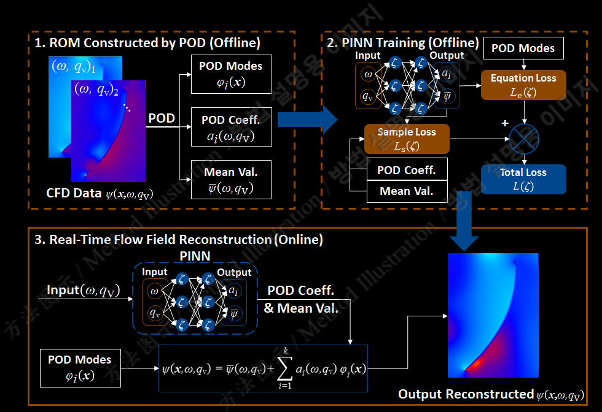

# 🌀 POD-PINN Based Main Pump Flow Field Predictor

- `./model_summon`: POD-PINN (original one, span=0.65)

- `./DLC`: POD-PINN with general centerization method, de-optimized. Temporarily disabled.

- `./FullOrder`: Modified POD-PINN, MLP, DeepONet(MLP,FNO,CNO,SA-CFNO as the trunk, MLP as the branch, span=0.5)**If you are the reviewer of the paper "Fast Reconstruct the Flow Field of the Main Coolant Pump in the Lead-cooled Fast Reactor by Physics-Informed Surrogate Modeling", please explore this filefolder for the code and research data related to this work.**

> This Repo is related to NURETH-21 Paper 1193(Developing a Real-Time Surrogate Model with POD-PINN Approach for the Flow Field in the Main Coolant Pump of Lead-Cooled Fast Reactors)'s PRESENTATION and a coming work planned to submit to a journal related to this repository. Because of the limitation on passage length during the conference, we failed to report all necessary experimental details in that work. However, we all agree that the effort we paid on the improvements of the model should be recorded to gather the experience and indicate the lessons we learnt from the procedure. That's how this repo was set up and the complete version of the paper was written.

> We welcome contributors from thermal-hydraulics, numerical methods, and AI modeling backgrounds—open to discussions and collaborations.

> If you like it plz star it⭐

## What's this thing even for?

This repo is for predicting the flow field of a **lead-cooled fast reactor main pump** under different operating conditions — quickly. Like, way faster than rerunning CFD every single time. The idea is: get the trends, save your time, and maybe shorten the design loop in the early stages.

### ✅ Why POD-PINN?

Instead of directly regressing full-field quantities (which are typically high-dimensional and expensive), we predict only the **modal coefficients** of a reduced-order basis, obtained via Proper Orthogonal Decomposition (POD). This ensures:

- **Dimensionality reduction**: The network only needs to regress a handful of coefficients (e.g., 4), drastically lowering the complexity of the learning task.
- **Physical structure preservation**: POD modes encode the dominant flow structures; thus, reconstructed fields retain meaningful physics.
- **Improved generalization**: By predicting only low-dimensional outputs, the risk of overfitting is reduced.
- **Efficient deployment**: Real-time predictions become feasible thanks to lightweight inference.

## ⚖ Compared against what?

The model was trained and tested using good ol’ CFD results — **Ansys CFX** simulations, to be exact. It's not just guessing in the dark. Although CFD simulations themselves are subject to modeling and numerical errors, the model’s effort to fit CFD data and to satisfy the governing equations are not always aligned. As a result, defining the loss purely as the relative error between the model output and CFD results is ultimately a compromise.

In fact, the CFD data used for pretraining already exhibit signs of **insufficient convergence**. For example, the pump cases under a steady-state rotating reference frame, the solution is expected to exhibit rotational symmetry across blades. However, as shown in our research paper, the CFD results display noticeable discrepancies between flow fields in adjacent blade passages—despite being purely numerical results, unaffected by experimental noise or boundary uncertainties. This strongly suggests that the CFD simulation itself has not fully converged to the correct physical solution.

Nevertheless, whether using `./model_summon/ReconstructORI.py` (KNN-based modal interpolation) or `./model_summon/Reconstruct.py` (neural network-based interpolation), training the model beyond the pretraining phase leads to a substantial drop—typically **1 to 2 orders** of magnitude—in the physics-based residual loss. This reduction is accompanied by a simultaneous improvement in test performance, indicating that the physics-informed training helps correct imperfections in the CFD data rather than merely fitting them.

## So... how well did it do?

Okay, we’ll be honest — not perfect. We’re dealing with **very high Reynolds numbers**, and we only used **4 POD modes**. That captured about 95% of the energy, but turns out, 95% isn't enough when the flow gets wild. (Even in some more linears occasions e.g. Only Thermal Conduction Evolved, other researches might used energy propotion more than 99%)

Why the error?  
- High nonlinearity, few modes = still a trade-off between speed and accuracy (max error ~35% in the paper)
- Reynolds numbers are huge → behavior becomes chaotic  
- The method’s better at catching **flow trends** (correlation > 0.7 in the paper), but struggles with absolute precision

In short: **great for trend detection, not so great for exact numbers**. But hey, sometimes that's all you need.

## Wait, the code doesn't match the paper?

Yep. In fact, this repository is an improved research version — with **different pump data**, **better-performing programs**, **more comprehensive testing methods**, **expanded and modular functions**, and, of course, **more sense of humour**. The original paper was based on earlier results — and, well, **conference page limits are brutal**, plus **some of the data is confidential**(possibly appear in my Master Thesis). So, a lot of juicy details had to be left on the cutting room floor. What you see here is the “director’s cut” — a more refined, fleshed-out version.

Funny story: I didn’t even realize neural network results could be kept consistent and reproducible using random seed control until the first peer review of another one of our projects. Before that, I was a complete noob in CS & AI and had no clue what a random seed even meant. That little revelation is actually how the [DRQI](https://github.com/LokimuKH19/DRQI) repo was born. I am still trying to get involved because I constantly think being an CS/AI researcher is cool, but before that I must manage to improve my functional analysis skill, to dive deeper into the model structure.

> Sept. 11, 2025: A new work is planned based on this updated code! New model with 8 orders of POD modes was built up in the `DLC` Folder.

---

## How does it work?

We combined two fancy techniques:

### 1. POD + PINN = ❤️
- **POD** (Proper Orthogonal Decomposition) breaks down the CFD flow fields into modes.
- Then **PINNs** (Physics-Informed Neural Networks) try to regress the modal coefficients under different working conditions.

**Equations?**
- POD:  

$$
\mathbf{U}(\mathbf{x}, t) \approx \sum_{i=1}^{N} a_i(t) \phi_i(\mathbf{x})
$$

- PINN:  
  Neural networks trained with physical constraints (governing equations baked into the loss function).

### 2. Radial layering (a.k.a. how we avoided running out of RAM)
- Initially, we ran POD **layer by layer** along the radial direction (cylindrical slices).
- But this caused issues when trying to interpolate the modal coefficients in the **r** direction.
- So the paper only reported **layer-averaged** performance. That’s why.

### 3. Discrete modes + autograd = 🤯
POD gives **discrete** spatial modes. But PINNs need **continuous gradients** (thanks, backprop).

**Solution?**  
We used interpolation (nearest neighbor in the paper, not so accurate as we expected when computing $\frac{\partial u}{\partial r}$) to make the modes differentiable. However that means this program has to run on a huge table which records the derivatives from each order of all spatial coordinates in the equation loss function. So in this repository we also tried NNs to be the interpolators, see in the `.\model_summon\Interpolation.py`

### 4. Sketch Map of POD-PINN Approach

>📌 This figure is a modified one from the original research paper and is only used for academic communication.

### 5. 🛠️ Potential Extensions
Here are some ideas for extending the current work:

- **Dynamic POD (DPOD)**: Include time as an input to capture temporal evolution of modal coefficients.
- **Truncated mode control**: Use only top-N energy modes for faster convergence.
- **Multi-physics coupling**: Extend the model to handle joint prediction of pressure, velocity, temperature fields, etc.
- **Uncertainty quantification**: Add dropout or Bayesian layers to estimate confidence intervals.

---

## 📎 Before You Use This

This model is experimental and was made in a lab — not a control room.

> ⚠️ **Disclaimer**:  
> This model is still in very early stage, for academic and research purposes only. It has not reached the standard of a production-grade, and definitely not reactor-grade.  
> **Any accidents, errors, or nuclear meltdowns caused by using this model are 100% on you.**  
> You've been warned. Use wisely. Or at least don't use it to control an actual LFR MCP.

---

## 🧠 Bonus: Why this matters

CFD is great, but slow. This approach tries to bridge that with a light, learnable model that still respects physics (see the explanation of the results in the paper). Think of it as:  
**“I want to *guess smart*, not *simulate slow*.”**

During my undergrad, my thesis was all about building a digital twin for the LFR MCP. Back then, I went with a **pure PINN** approach. It worked — kind of. The relative error in the flow field was around **15%**, which isn’t bad.  **BUT** the dataset was *huge*, training was *painfully slow*💀

So I’ve been on the hunt for a better way ever since. This POD-PINN thing?  
It’s a work-in-progress. It **needs way less data** (yay!) but the accuracy? Still not ideal (meh).  
Call it an *unsuccessful attempt at being efficient*, but hey — at least it's a step.

Stay curious. Stay skeptical. And always double-check what the Raynolds number(lol). Enjoy the code in `model_summon` filefolder.

## 🆙 Update Records
### Sept.10 2025: 
- Arbitary modal numbers could be applied in `model_summon/ReconstructORI.py` now.
- Models could be loaded for continue to train in `model_summon/ReconstructORI.py` now.

## 🖊 Write at the end -- Some thoughts

When I started the repo of [DRQI](https://github.com/LokimuKH19/DRQI), I first realized that an open-source platform lets me keep updating ideas anytime — unlike papers that get fixed once published. So this repo is not just about the POD-PINN project but also a place where I’ll try out all kinds of AI algorithm stuff, even if it’s not directly related to my main field. Also, I hope I can provide a PINN developing framework which is easy to use to my colleagues from engineering fields in need.

Organizing code, tuning the models, designing the experiments and making the UI have been both tough and fun — lots of trial and error, but that’s how you learn and improve.

Big thanks to the Nureth-21 conference for the inspiration and great discussions. Also, learning Korean along the way has been surprisingly fun.

If you find this repo useful, feel free to give it a star — it really means a lot!
