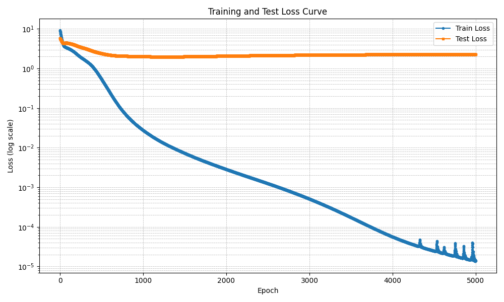
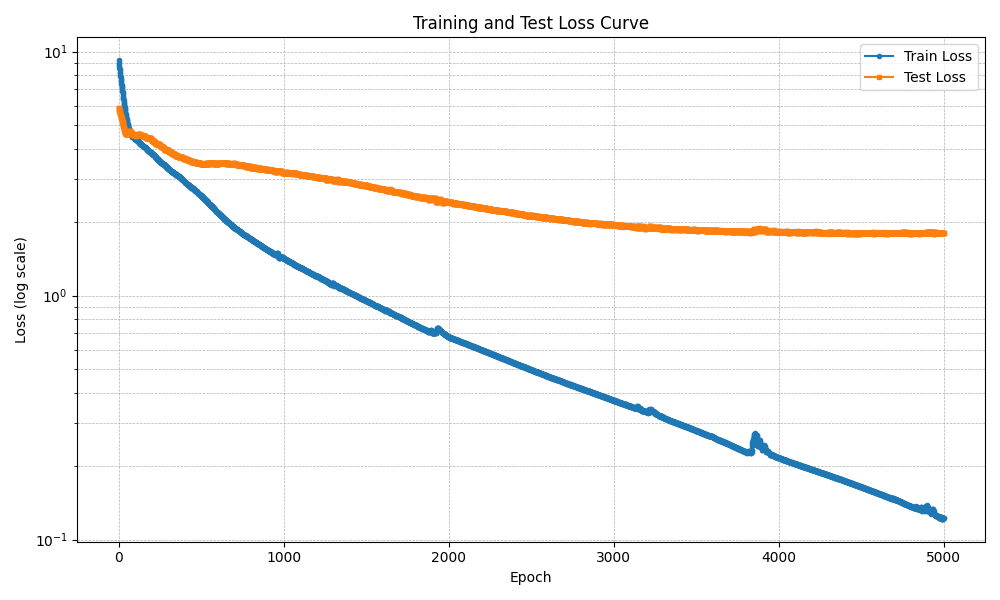

# Result Discussion of POD-PINN with KNN Interpolator

This is a detailed discussion of the enhanced program `../ReconstructORI.py`(The method we adopted in the paper and with better performance, reproductivity and more readable and debugging friendlier code). It leverages pre-computed modal bases for the reconstruction of physical fields, and introduces a carefully balanced combination of **data loss** and **physics loss**.

---

## 🔧 Key Features

- **ROM-Based Interpolation**: Predicts reduced coefficients and reconstructs full fields using interpolated modes (`SmoothKNNInterpolator`).
- **Normalized Input/Output**: All physical quantities are normalized to stabilize training.
- **Physics Loss Supervision**: Uses physics residuals (continuity + momentum) as *regularization*, not strict minimization.
- **Gradient Flow Enabled Call**: Model supports gradient-enabled forward pass via `enable_grad=True` for computing PDE residuals.
- **Coordinate Shift for Stability**: All coordinates are shifted by `1e-6` to avoid gradient instabilities in physics loss.
- **Physics/Data Loss Balancing**: Physics loss is divided by `1e6` to match the scale of data loss and prevent it from dominating.
- **Batch-based Physics Loss**: Efficient sampling strategy over spatial and parametric dimensions to accelerate training.
- **Flexible Training Modes**: Supports both random point sampling and full coordinate-batch training (configurable).

---

## 📦 Data Requirements

The following files are expected in the working directory:

```
../EXP.csv                    # Experimental parameters: omega, qv, and split flags
../coordinate.csv             # All spatial coordinates (r, theta, z)
../ReducedResults/coefficients_{P,Ut,Ur,Uz}.csv  # Modal coefficients for each variable
../ReducedResults/mean_{P,Ut,Ur,Uz}.csv          # Mean value for each variable
../ReducedResults/modes_{P,Ut,Ur,Uz}.csv         # Mode bases (M x 4 matrix per variable)
```

---

## 🧠 Model Structure

Each variable (`P`, `Ut`, `Ur`, `Uz`) is predicted by a shared neural network architecture:

- Input: 2D normalized condition vector `[omega, qv]`
- Output: 4 normalized modal coefficients + 1 normalized mean
- Hidden Size: Configurable (`hidden_dim`, default = 64)
- Activation: `Tanh`

Reconstruction uses:
```python
field = torch.matmul(interpolated_modes, predicted_coeffs.T).squeeze() + mean
```

---

## ⚙️ Training Logic

Two types of loss are computed:

### 1. Data Loss
Supervised regression on reduced coefficients and means.

### 2. Physics Loss
Computed from the residuals of:

- Continuity equation
- Navier-Stokes momentum equations (r, θ, z components)

Residuals are calculated using autograd on reconstructed fields. Physics loss is scaled down:
```python
physics_loss /= 1e6
```

### 3. Combined Loss
```python
total_loss = data_loss + physics_loss
```

> 📌 Note: Physics loss is used **as a soft constraint**, guiding training without forcing convergence. This stabilizes learning without overwhelming the supervised signal.

---

## 🏋️ Training Entry Point

```python
if __name__ == "__main__":
    pinn = PINNSystem(hidden_dim=30, lr=1e-3, use_physics_batch=False)
    train_loss, test_loss = train_PINN(pinn, epochs=100, coord_batch_size=64)
```

Set `use_physics_batch=True` to use **full coordinate batches**, which improves accuracy but increases computational cost.

---

## 📈 Inference Example

```python
example_coords = torch.tensor([[0.1, 0.05, -0.1]], dtype=torch.float32)
condition = torch.tensor([630, 0.65])  # Unnormalized
result = pinn(example_coords, condition)
print(result)
```

Returns a dictionary of reconstructed physical fields (`P`, `Ut`, `Ur`, `Uz`) at the specified location.

---

## 🧪 Physics Residual Sanity Check

To test if residuals are reasonable:
```python
with torch.enable_grad():
    coords = torch.tensor(..., requires_grad=True)
    cond = torch.tensor(..., requires_grad=True)
    loss = pinn.compute_physics_residuals(coords, cond.unsqueeze(0))
```

---

## 📎 Notes

- Model is sensitive to the scaling of physical constants. If modifying the domain or units, re-check normalization.
- Setting `coords += 1e-6` is **crucial** to avoid `NaN` in autograd derivatives.
- Physics loss should not be minimized to zero; instead, it should remain bounded (e.g., < 1e2) for meaningful constraints.

---

# ✔ Result Discussion
## 🔍 Model Training Observation & Comparison

We conducted extensive training for **5000 epochs** comparing two PINN variants:
1. **With physics loss (POD-PINN + constraint residuals)**
2. **Without physics loss (pure POD-PINN)**

### ✅ Generalization Advantage

Even though the physics-supervised model may not reach as low a **train loss** as the baseline model (without physics), it **clearly generalizes better**:

- The **test loss** shows continuous downward trends, indicating that the physics supervision helps prevent overfitting.
- In contrast, the baseline model saturates early on, showing signs of overfitting despite achieving lower training errors.

### 🧪 Physics Residual Behavior

We employ a **mini-batch sampling strategy** over spatial coordinates to compute physics residuals at each epoch. Even with this stochastic method, we observe:

- The initial physics loss is as high as **~14.0** in early training.
- Over the course of training, the physics loss stabilizes and converges to the range of **~1** even the points of each mini batch were selected randomly at each epoch, showing the network is learning to obey the physical laws embedded in the equations.

This reflects the benefit of injecting physics consistency even if applied only at randomly sampled coordinate subsets during each epoch.

### 📉 Loss Trends

**Model Without Physical Constraints**



**Model With Physical Constraints**



---

### 📊 Final Epoch Loss Summary

| Model Variant              | Train Loss ↓ | Test Loss ↓ | Evaluation |
|---------------------------|--------------|-------------|-------------|
| Without Physics Loss      | **almost 0**  |  **2.20** | Overfitted, the Testing Loss Stopped Going Down at the ~500th Epoch |
| With Physics Loss         | **0.11**  |  **1.39** | The Testing Loss Continued to Decrease even after the 4000th Epoch, But Underfitted |

> Test loss continues to decrease in the physics-supervised version, confirming stronger generalization and physically meaningful prediction.

---

### 🚧 Not the Final Model

Due to compute constraints, we have **not yet evaluated the full-coordinates physics-supervised model**, which computes physics residuals at **all coordinate points** (instead of random mini-batches). It's clear that such a variant would:
- Increase the physical consistency
- Further reduce generalization error
- Act as a final refinement step

This work remains as **future enhancement**, and we expect it to further close the accuracy gap between prediction and ground truth.

---

## 🔮 Future Work – Physics-aware Pretraining

To take advantage of both architectures:
- We aim to **pretrain** the model **without physics loss**, which converges faster.
- Then **finetune** using the **full physics-supervised loss**, focusing on physical accuracy and generalization.

This strategy combines:
- **Fast convergence** of data-only models
- **Accuracy + physical consistency** of physics-regularized models

This hybrid training scheme is expected to **reduce total training time** while improving **long-term prediction quality** and robustness. After adding the `pretrain_epoch` parameters to `train_PINN()` function, the model switches to the loss function without physical constraints before PINN training, in order to make the starting point of both the train loss and test loss lower:
```python
    if pretrain_epoch:
        # pretrain the model with `pretrain_epoch` epochs
        system.use_physics_loss = False
        for ep in range(1, pretrain_epoch+1):
            system.pretrain_epoch += 1
            train_loss, test_loss, phy_loss = system.step(coord_batch_size)
            print(f"[PretrainEpoch {ep:04d} Summary] Avg Train Loss = {train_loss:.6f} | Avg Test Loss = {test_loss:.6f}")
            train_loss_history.append(train_loss)
            test_loss_history.append(test_loss)
```

In addition, I noticed that the PINN was underfitted in the previous experiment, thus I switched the initial lr from 1e-3 to 5e-3. Then a more reasonable training strategy was proposed:
```
    scheduler = None
    if use_scheduler:
        scheduler = torch.optim.lr_scheduler.ReduceLROnPlateau(
            system.optim,
            mode='min',
            factor=scheduler_factor,
            patience=scheduler_patience,
            min_lr=scheduler_min_lr,
            verbose=True
        )
```
This helps the Global Learning Rate‌ to decrease intelligently according to the training performance. If after `scheduler_patience` epochs the learning effect is not improved, then the Global Learning Rate will become `scheduler_factor` times. In addition, I also activated `use_physics_batch=True` and trained for 63 epochs, which caused 63*63=3969 iterations.

🚀 And, we got these convergence curves:


> The first 50 epochs are in the pretraining stage. From the convergence curves we can see the physics constraints significantly improved the astringency of both the training and testing losses.

This model experienced the least iterations and was the best model in this filefolder, with the final training loss **0.017** and testing loss **1.36**. This indicates a very strong generalizability of the models with physical constraints caring about all spatial coordinates.

---
## 📚 Future Plans

- Add support for additional physical quantities and alternative boundary conditions.
- Explore physics loss weighting via dynamic loss balancing (e.g., using uncertainty or GradNorm).
- If you have a better device (Mine is NVIDIA Geforce RTX 2060), you can use `use_physics_batch=True` to get a better model


---
